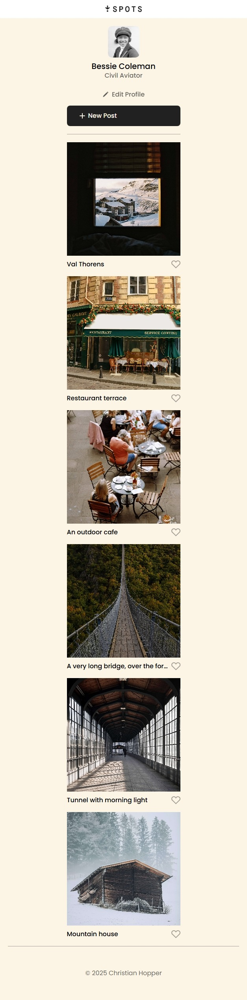

# Spots

**Spots** is a dynamic photo-sharing web application where users can showcase and explore beautiful locations, memorable moments, and inspiring scenes from around the world.

## Features

- **User Profile Management**
  - Edit your name, bio, and profile picture
- **Card System**
  - Create and view photo cards with captions
  - Like and delete your own cards
- **Responsive Modals**
  - Edit profile, update avatar, preview images, add new posts, and confirm deletions with interactive modal windows
- **Form Validation**
  - Real-time form validation with helpful error messages
- **API Integration**
  - Fetch and persist user info and cards via RESTful endpoints

## Technologies Used

- HTML5
- CSS3 (BEM methodology)
- JavaScript (ES6+)
- Webpack
- REST API
- Git & GitHub

## Key Functionality

- `Api.js`: Handles all API calls (fetch cards, update user info/avatar, add/delete cards, toggle likes).
- `Card.js`: Creates card elements with like and delete functionality.
- `UserInfo.js`: Manages and updates user profile info in the UI.
- `Modal.js`: Opens and closes modals.
- `validation.js`: Enables and resets client-side form validation.
- `helpers.js`: Utility helpers like `setButtonText()` for improved UX.

## Deployment

This project is deployed on GitHub Pages:

[View Live Site](https://christian-hopper.github.io/se_project_spots)

## Walkthrough Video

Here’s a video walkthrough of my thought process behind the development:

[Watch on Google Drive](https://drive.google.com/file/d/1dBxARI2zRCNyJ-I0HxaCEEbsOjGCzNMM/view?usp=sharing)

## Screenshots

| Desktop | Mobile |
|--------|--------|
|  |  |

## Plans for Improvement

- Add user authentication (sign up/login)
- Enable comments on posts
- Improve accessibility (ARIA roles, keyboard navigation)
- Add a dark mode toggle

## Author
Created by Christian Hopper
