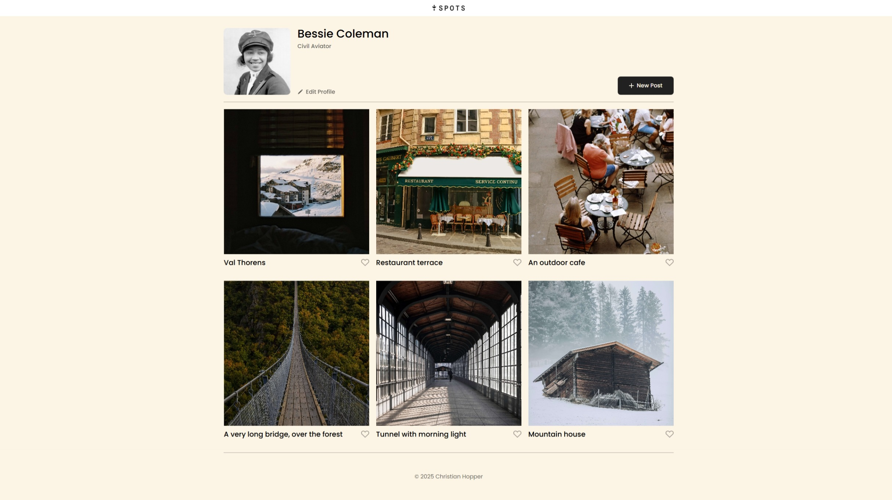

# Project 3: Spots

### Overview

- Description
- Features
- Deployment
- Walkthrough Video
- Images
- Plans for Improvement
- Author

**Description**

The Spots webpage allows users to:

- Explore a profile section featuring a user photo, biography, and customizable options.
- View a gallery of beautiful, travel-inspired photo cards.
- Interact with profile and post buttons (currently static, with plans for future interactivity).
- Enjoy a visually engaging layout optimized for clean looks.

**Features**

- Semantic HTML5
- BEM file structure for scalable and maintainable code
- Flexbox layout for responsive design
- Placeholder buttons for profile and post interactivity
- Google Fonts integration
- Use of SVG and image files for high-quality graphics
- Clear visual hierarchy with CSS styling
- Favicon integration for brand identity
- Mobile-friendly and responsive design

**Deployment**

This webpage is deployed to GitHub Pages:

- [Deployment Link](https://christian-hopper.github.io/se_project_spots)

**Walkthrough Video**

I have made a video walking through my thought process of making this webpage:

- [Deployment Link](https://drive.google.com/file/d/1dBxARI2zRCNyJ-I0HxaCEEbsOjGCzNMM/view?usp=sharing)

**Images**

**Plans for Improvement**

- Add interactivity with JavaScript

**Author**
Created by Christian Hopper
